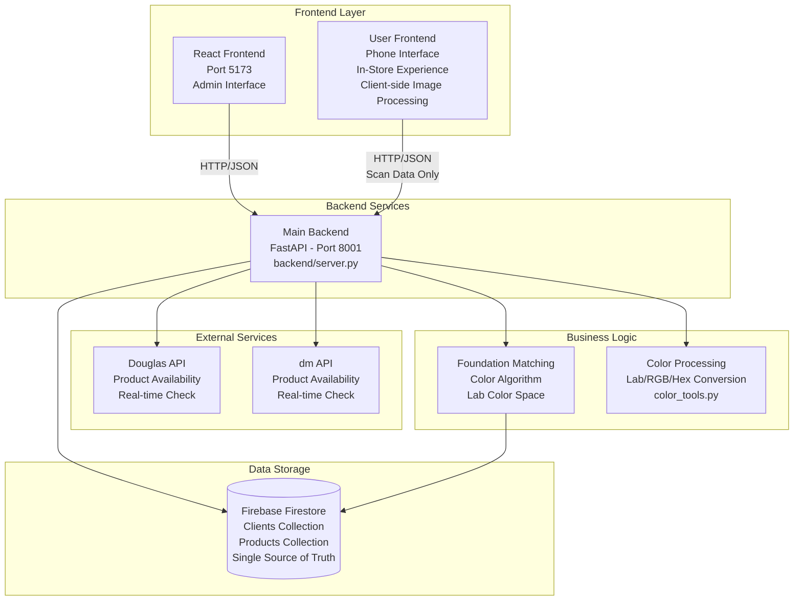
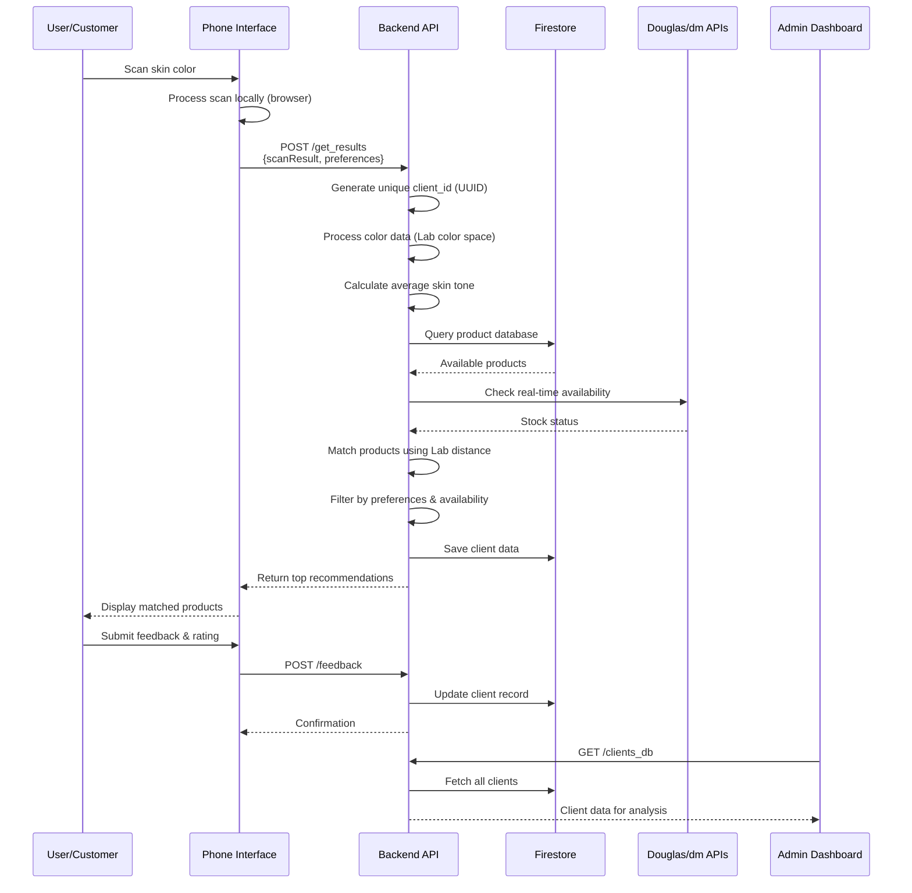

# MakeupMatch Backend Documentation

**Document Purpose:** Technical documentation for outsourcing company to understand current backend architecture and plan for scalable rebuild.

**Date:** January 16, 2026  
**Current Version:** Development Branch  
**Deployment:** Google Cloud Platform (App Engine)

---

## Table of Contents

1. [Executive Summary](#executive-summary)
2. [System Architecture](#system-architecture)
3. [Technology Stack](#technology-stack)
4. [Core Components](#core-components)
5. [Data Flow](#data-flow)
6. [Database Structure](#database-structure)
7. [API Endpoints](#api-endpoints)
8. [Business Logic](#business-logic)
9. [External Integrations](#external-integrations)
10. [Known Limitations & Scalability Issues](#known-limitations--scalability-issues)
11. [Recommendations for Rebuild](#recommendations-for-rebuild)

---

## Executive Summary

MakeupMatch is an AI-powered foundation matching system designed for in-store retail experiences. The system:

- **Captures** skin color scans (processed in browser)
- **Processes** skin tone in Lab color space for accurate color matching
- **Recommends** foundation products from Douglas and dm stores
- **Collects** user feedback for continuous improvement

**Current Deployment:**

- Backend: FastAPI (Python) on Google Cloud Platform
- Database: Firebase Firestore (single source of truth)
- Frontend: React (Vite) + User-facing phone interface with client-side image processing
- Status: Production-ready but requires architectural improvements for scalability

---

## System Architecture

### High-Level Architecture Diagram



### Data Flow Diagram



---

## Technology Stack

### Backend Technologies

| Category          | Technology              | Version | Purpose                 |
| ----------------- | ----------------------- | ------- | ----------------------- |
| **Framework**     | FastAPI                 | Latest  | REST API server         |
| **Language**      | Python                  | 3.x     | Core language           |
| **Database**      | Firebase Firestore      | Latest  | Primary data storage    |
| **Color Science** | Custom Lab color module | -       | Color space conversions |
| **HTTP Client**   | Requests                | Latest  | External API calls      |
| **Deployment**    | Google App Engine       | -       | Cloud hosting           |

### Key Dependencies

From `backend/requirements.txt`:

- `fastapi` - Web framework
- `uvicorn` - ASGI server
- `firebase-admin` - Firestore SDK
- `numpy` - Numerical operations
- `pandas` - Data manipulation (CSV export)

---

## Core Components

### 1. Main Server (`backend/server.py`)

**Purpose:** Central API server handling all backend operations

**Key Features:**

- FastAPI application with CORS enabled
- Multiple frontend origins supported
- Handles file uploads (multipart/form-data)
- Routes for matching, feedback, and data export

**Port:** 8001

**CORS Origins:**

```python
- http://localhost:5173  # Dev frontend
- http://localhost:8003  # User frontend
- https://makeupmatch-*.web.app  # Firebase hosting
```

### 2. Database Service (`backend/lib/clients_db.py`)

**Purpose:** Data persistence layer using Firebase Firestore

**Key Features:**

- Firebase Firestore integration
- Client data CRUD operations
- Summary collection pattern (50 clients per document)
- Product data loaded from Firestore on backend startup

### 3. Foundation Matching Service (`backend/lib/foundation_matching.py`)

**Purpose:** Core algorithm for matching skin tones to products

**Algorithm:**

1. Convert RGB scan data to Lab color space
2. Calculate average skin tone from multiple scan points
3. Query all available products from Firestore
4. Calculate Delta E (Lab color distance) for each product
5. Filter by user preferences (coverage, skin type, occasion)
6. Check real-time availability at Douglas/dm stores
7. Sort by color match quality
8. Return top 100 recommendations

**Key Metrics:**

- Lab Delta E < 2: Excellent match
- Lab Delta E 2-6: Good match
- Lab Delta E > 6: Poor match

### 4. Color Processing (`backend/lib/color_tools.py`)

**Purpose:** Color space conversions and color science utilities

**Conversions:**

- RGB ↔ Lab (CIE Lab color space)
- RGB ↔ Hex
- Lab ↔ Hex

**Lab Color Space Benefits:**

- Perceptually uniform (Delta E = perceived color difference)
- Better for skin tone matching than RGB
- Industry standard for cosmetics

### 5. Product Database Parsers

**Douglas:** `backend/database/Douglas/parse.py`
**dm:** `backend/database/dm/parse.py`

**Purpose:** Parse and update product catalogs from store APIs

**Data Stored:**

- Product GTIN (barcode)
- Brand name
- Product name & description
- Shade name
- Lab color values
- RGB/Hex color representation
- Price
- Coverage level
- Category (foundation, concealer, etc.)

### 6. Firestore Product Service (`backend/lib/firestore_product_service.py`)

**Purpose:** Product data management and availability checking

**Features:**

- Load all products from Firestore on backend startup
- Query products by store (Douglas/dm)
- Check stock availability via external APIs
- Filter by product attributes
- In-memory cache during runtime

---

## Database Structure

### Firestore Collections

#### 1. `clients_summary` Collection

**Structure:**

```
clients_summary/
├── 0/                    # Documents 0-49
│   └── {client_data}     # Map of client_id → client_object
├── 1/                    # Documents 50-99
│   └── {client_data}
└── ...
```

**Document Schema:**

```json
{
  "client_id_1": {
    "client_id": "uuid",
    "features": {...},
    "user_flow": {...},
    "recommendation_focus": {...},
    "feedback": {...}
  },
  "client_id_2": {...}
}
```

**Reason for such structure:** To reduce amount of queries to the Firestore for a dashboard service, that shows analytics for all users.
**Issue:** Linear scaling problem - must query multiple documents to find a specific client.

#### 2. `clients` Collection (Individual Documents)

**Document ID:** `client_id` (UUID)

**Schema:**

```json
{
  "client_id": "7ca8d1dd-aea9-4342-a7d3-eae373152d35",
  "features": {
    "colors_lab": {
      "1": { "L": 59.36, "a": 12.46, "b": 17.12 },
      "2": { "L": 52.12, "a": 17.08, "b": 19.93 },
      "3": { "L": 55.66, "a": 14.02, "b": 15.83 }
    },
    "colors_hex": {
      "1": "#d5ae98",
      "2": "#c4927b",
      "3": "#caa08e"
    },
    "color_avg_lab": { "L": 55.66, "a": 14.02, "b": 15.83 },
    "color_avg_hex": "#cca08b",
    "option_data": {
      "hair_color": "brown",
      "skin_type": "oily"
    }
  },
  "user_flow": {
    "result_page_timestamp": "2025-05-20T09:44:55.336949",
    "phone_page_results_timestamp": null,
    "exit_timestamp": null
  },
  "recommendation_focus": {
    "filters": {
      "category": [],
      "coverage": [],
      "others": ["Available"]
    },
    "final_recommendations": [
      {
        "brand": "MAC",
        "product_name": "Studio Fix Fluid SPF 15",
        "shade": "NC25",
        "gtin": "773602123456",
        "price": "37.00 EUR",
        "color_match_score": 8.5,
        "lab_delta_e": 4.2,
        "available": true,
        "store": "Douglas"
      }
    ]
  },
  "feedback": {
    "rating": 5,
    "tried_products": true,
    "product_available": true,
    "changed_mind": false,
    "products_tried_count": 2,
    "purchased_product": "MAC Studio Fix Fluid NC25",
    "important_factor": "Color match",
    "brand_preference": "No preference",
    "would_switch_brand": true,
    "comments": "Perfect match!"
  }
}
```

#### 3. `products` Collection

**Collections:**

- `products_douglas` - Douglas store products
- `products_dm` - dm store products

**Schema:**

```json
{
  "gtin": "773602123456",
  "brand": "MAC",
  "name": "Studio Fix Fluid SPF 15",
  "shade": "NC25",
  "category": "foundation",
  "coverage": "full",
  "lab": [55.2, 14.1, 17.8],
  "rgb": [204, 160, 139],
  "hex": "#cca08b",
  "price": "37.00",
  "currency": "EUR",
  "url": "https://...",
  "available": true,
  "last_updated": "2025-05-15T10:30:00Z"
}
```

---

## API Endpoints

### Main Backend API (Port 8001)

#### 1. `POST /get_results`

**Purpose:** Process user scan data and return foundation recommendations

**Request:**

```json
{
  "config": {
    "store_name": "dm",
    "store_location": "D522",
    "language": "de",
    "browser_name": "Chrome"
  },
  "answers": [
    {
      "type": "scan",
      "scanResult": [
        [51.469802, 12.236178, 20.265245],
        [51.2892, 11.933268, 19.643599],
        [50.241417, 11.978864, 19.813293]
      ]
    },
    {
      "type": "camera",
      "features": null
    },
    {
      "type": "options",
      "answer": "combination",
      "question_name": "skin_type",
      "question": "What is your skin type?",
      "options": {
        "oily": "Oily",
        "dry": "Dry",
        "combination": "Combination",
        "sensitive": "Sensitive",
        "normal": "Normal",
        "other": "Other"
      }
    }
  ]
}
```

**Response:**

```json
{
  "user_id": "4350a97d-4499-45d1-aab9-6305d84a7ed7",
  "timestamp": "2026-01-16T16:06:43.639155",
  "client": {
    "color": "#d1ab94"
  },
  "products": [
    {
      "product_id": "3600523614455",
      "product_brand_name": "L'ORÉAL PARiS",
      "product_description": "Foundation Infaillible 32H Fresh Wear, 120 Vanilla, LSF 25, 30 ml",
      "product_color_swatch": "#cf9774",
      "product_image": "https://products.dm-static.com/images/f_auto,q_auto,c_fit,h_320,w_320/v1755083681/assets/pas/images/fb21b4ac-f53c-473c-9415-30b959d19875/l-oreal-paris-foundation-infaillible-32h-fresh-wear-120-vanilla-lsf-25",
      "product_link": "https://www.dm.de/l-oreal-paris-foundation-infaillible-32h-fresh-wear-120-vanilla-lsf-25-p3600523614455.html",
      "price": "13,95 €",
      "type": "foundation",
      "match_percentage": "99%",
      "color_distance": 0.6002477437500104,
      "erp_connection": true,
      "instore_status": true,
      "online_status": true,
      "stock_level": 4,
      "store_brand": "dm",
      "features": {
        "texture": ["liquid"],
        "coverage": ["full"],
        "skin-type": [
          "damaged-skin-barrier",
          "oily",
          "dry",
          "sensitive",
          "normal",
          "mature",
          "combination"
        ],
        "preferences": ["waterproof", "with-spf"],
        "effect": ["glowy", "long-lasting"],
        "spf-level": ["25"]
      },
      "ingredients": "INGREDIENTS: AQUA / WATER • DIMETHICONE • ISODODECANE • ALCOHOL DENAT. • ETHYLHEXYL METHOXYCINNAMATE • BUTYLENE GLYCOL • TRIMETHYLSILOXYSILICATE • TITANIUM DIOXIDE [NANO] / TITANIUM DIOXIDE • PEG-10 DIMETHICONE • PERLITE • SYNTHETIC FLUORPHLOGOPITE • NYLON-12 • ISOPROPYL LAUROYL SARCOSINATE • DIISOPROPYL SEBACATE • HDI/TRIMETHYLOL HEXYLLACTONE CROSSPOLYMER • DISTEARDIMONIUM HECTORITE • BIS-PEG/PPG-14/14 DIMETHICONE • MAGNESIUM SULFATE • ALUMINUM HYDROXIDE • PHENOXYETHANOL • DISODIUM STEAROYL GLUTAMATE • HYDROGEN DIMETHICONE • CELLULOSE • DIPENTAERYTHRITYL TETRAHYDROXYSTEARATE/TETRAISOSTEARATE • ASCORBYL GLUCOSIDE • SILICA SILYLATE • PARFUM / FRAGRANCE • TOCOPHEROL • SILICA • HEXYL CINNAMAL • BENZYL SALICYLATE • BHT • LINALOOL • ALPHA-ISOMETHYL IONONE • BENZYL ALCOHOL • CITRONELLOL ● [+/- MAY CONTAIN: CI 77891 / TITANIUM DIOXIDE • CI 77491, CI 77492, CI 77499 / IRON OXIDES • CI 77163 / BISMUTH OXYCHLORIDE • MICA]. (F.I.L. Z70045346/1)."
    },
    {
      "product_id": "800897234300",
      "product_brand_name": "NYX PROFESSIONAL MAKEUP",
      "product_description": "Foundation Bare With Me Blur Tint Light 04 Neutral, 30 ml",
      "product_color_swatch": "#cf9b7c",
      "product_image": "https://products.dm-static.com/images/f_auto,q_auto,c_fit,h_320,w_320/v1755072607/assets/pas/images/c2f95ca3-c069-482d-83c5-b82c6230cd9b/nyx-professional-makeup-foundation-bare-with-me-blur-tint-light-04-neutral",
      "product_link": "https://www.dm.de/nyx-professional-makeup-foundation-bare-with-me-blur-tint-light-04-neutral-p800897234300.html",
      "price": "4,95 €",
      "type": "foundation",
      "match_percentage": "98%",
      "color_distance": 0.8641099405470898,
      "erp_connection": true,
      "instore_status": false,
      "online_status": false,
      "stock_level": 0,
      "store_brand": "dm",
      "features": {
        "coverage": ["light"],
        "skin-type": [
          "damaged-skin-barrier",
          "oily",
          "dry",
          "sensitive",
          "normal",
          "mature"
        ],
        "preferences": ["vegan"],
        "texture": ["liquid"]
      },
      "ingredients": "INGREDIENTS: DIMETHICONE • AQUA / WATER / EAU • ISODODECANE • GLYCERIN • SILICA • PEG-9 POLYDIMETHYLSILOXYETHYL DIMETHICONE • PROPYLENE GLYCOL • DISTEARDIMONIUM HECTORITE • DIMETHICONE CROSSPOLYMER • PEG-10 DIMETHICONE • CETYL PEG/PPG-10/1 DIMETHICONE • PHENOXYETHANOL • SODIUM CHLORIDE • POLYGLYCERYL-4 ISOSTEARATE • CAPRYLYL GLYCOL • DISODIUM STEAROYL GLUTAMATE • ETHYLHEXYLGLYCERIN • ALUMINUM HYDROXIDE • BUTYLENE GLYCOL • CAMELLIA SINENSIS LEAF EXTRACT • NIACINAMIDE • SODIUM HYALURONATE • TOCOPHEROL • PENTAERYTHRITYL TETRA-DI-T-BUTYL HYDROXYHYDROCINNAMATE ● [+/- MAY CONTAIN: CI 77891 / TITANIUM DIOXIDE • CI 77491, CI 77492, CI 77499 / IRON OXIDES]. (F.I.L. N70013032/5)."
    }
  ],
  "product_types": [
    "BB-cream and CC-cream",
    "concealer",
    "foundation",
    "highlighter",
    "powder"
  ]
}
```

**Process Flow:**

1. Generate unique client_id
2. Process color data (Lab space)
3. Calculate average skin tone
4. Query and match products from Firestore
5. Check availability via external APIs
6. Save client data to Firestore
7. Return recommendations

#### 2. `POST /feedback`

**Purpose:** Collect user feedback after product trial

**Request:**

```json
{
  "client_id": "uuid",
  "rating": 5,
  "tried_products": true,
  "purchased_product": "MAC Studio Fix Fluid NC25",
  "comments": "Perfect match!"
}
```

**Response:**

```json
{
  "status": "success",
  "message": "Feedback saved"
}
```

#### 3. `GET /clients_db`

**Purpose:** Retrieve all client data for admin dashboard

**Response:**

```json
{
  "clients": [
    {
      "client_id": "uuid",
      "timestamp": "ISO-8601",
      "recommendations": [...],
      "feedback": {...}
    }
  ],
  "total_count": 150
}
```

**Issue:** Returns ALL clients - no pagination, no filtering

#### 4. `GET /download_clients_db`

**Purpose:** Export client data as CSV for analysis

**Response:** CSV file download

**Fields:**

- client_id
- timestamp
- average_color_hex
- recommended_products
- rating
- purchased_product

#### 5. `GET /health`

**Purpose:** Health check endpoint

**Response:**

```json
{
  "status": "healthy",
  "timestamp": "ISO-8601"
}
```

---

## Business Logic

### Foundation Matching Algorithm

**File:** `backend/lib/foundation_matching.py`

**Step-by-Step Process:**

1. **Color Space Conversion**

   ```python
   # Convert RGB scan to Lab
   lab_colors = [rgb_to_lab(r, g, b) for r, g, b in scan_results]
   avg_lab = calculate_average(lab_colors)
   ```

2. **Product Query**

   ```python
   # Get all products from Firestore
   products = firestore_product_service.get_all_products()
   ```

3. **Color Distance Calculation**

   ```python
   # Calculate Delta E (Lab color difference)
   for product in products:
       delta_e = sqrt(
           (avg_lab[0] - product.lab[0])**2 +
           (avg_lab[1] - product.lab[1])**2 +
           (avg_lab[2] - product.lab[2])**2
       )
       product.match_score = 10 - (delta_e / 2)  # Normalize to 0-10
   ```

4. **Preference Filtering**

   ```python
   # Filter by user preferences
   filtered = [p for p in products if
       p.coverage in user_preferences['coverage'] and
       p.category in user_preferences['category']
   ]
   ```

5. **Availability Check**

   ```python
   # Check real-time availability
   for product in filtered:
       product.available = check_store_api(product.gtin)
   ```

6. **Sorting & Selection**
   ```python
   # Sort by match score, prioritize available
   sorted_products = sorted(filtered,
       key=lambda p: (p.available, p.match_score),
       reverse=True
   )
   return sorted_products[:10]  # Top 10
   ```

---

## External Integrations

### 1. Douglas API

**Purpose:** Check product availability in Douglas stores

**Endpoint:** (External API - details in backend code)

**Integration Points:**

- Real-time stock checking
- Product catalog updates
- Price information

**Files:**

- `backend/database/Douglas/parse.py` - Product catalog parser
- `backend/lib/foundation_matching_service.py` - API calls

### 2. dm API

**Purpose:** Check product availability in dm stores

**Integration Points:**

- Real-time stock checking
- Product catalog updates
- Price information

**Files:**

- `backend/database/dm/parse.py` - Product catalog parser
- `backend/lib/foundation_matching_service.py` - API calls

### 3. Firebase Firestore

**Purpose:** Primary database

**Operations:**

- Read/Write client data
- Query product database
- Update feedback

**Authentication:** Firebase Admin SDK with service account key

**File:** `key_firebase.json` (service account credentials)

---

## Contact Information

For questions about this documentation or the system, please open an issue on GitHub.

**Documentation Date:** January 19, 2026

---

## Appendix A: File Structure

```
backend/
├── server.py                          # Main FastAPI server
├── requirements.txt                   # Python dependencies
├── app.yaml                           # GCP App Engine config
├── lib/
│   ├── clients_db.py                  # Database service (Firestore)
│   ├── foundation_matching.py         # Matching algorithm
│   ├── foundation_matching_service.py # Service wrapper
│   ├── firestore_product_service.py   # Product queries
│   └── color_tools.py                 # Color conversions
├── database/
│   ├── Douglas/
│   │   └── parse.py                   # Douglas product parser
│   └── dm/
│       └── parse.py                   # dm product parser
```

**End of Documentation**
